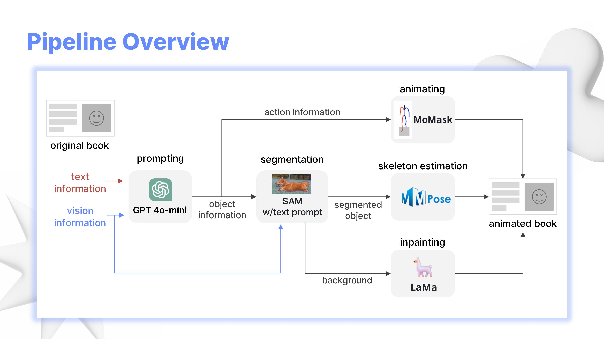

# 동생: 동화책에 생명을 불어넣는 AI 애니메이팅 서비스

https://github.com/user-attachments/assets/9c9e604c-8171-46a6-90db-8e6871654b50

2024 AI 핵심기술 기반 실무 프로젝트 2 수업

동화책의 한 장면을 입력하면 그림 속 등장인물이 문맥에 맞게 움직이는 영상을 출력합니다. ([발표자료](./DongSaeng.pdf))

## 파이프라인



1. 동화책의 한 장면을 GPT를 이용하여 분석하고, 다음 작업에 필요한 프롬프트를 생성한다.
2. GPT로 부터 생성된 프롬프트를 이용하여 등장인물을 segment 한다.
3. GPT로 부터 생성된 프롬프트를 이용하여 문맥에 맞는 동작을 생성한다.
4. segment된 등장인물의 관절 위치를 추정한다.
5. 등장인물이 제거된 배경 이미지를 inpainting을 통해 채워준다.
6. 생성된 동작을 segment된 등장인물에 렌더링하고 inpaint된 배경을 더해준다.

## 설치

<details>

### 1. [Language Segment-Anything](https://github.com/luca-medeiros/lang-segment-anything.git) 설치
text prompt로 지정하는 물체를 segment 하는 기술
```
git clone https://github.com/luca-medeiros/lang-segment-anything.git
conda create -n langsam python=3.11
cd lang-segment-anything
pip install -e .
```

### 2. [LaMa](https://github.com/advimman/lama.git) 설치
이미지의 누락된 부분을 자연스럽게 채워주는 기술
```
git clone https://github.com/advimman/lama.git
cd lama
conda env create -f conda_env.yml
conda activate lama
conda install pytorch torchvision torchaudio cudatoolkit=10.2 -c pytorch -y
pip install pytorch-lightning==1.2.9
```

### 3. [MMPose](https://github.com/open-mmlab/mmpose.git) 설치
관절의 위치를 추정하는 기술
```
git clone --branch 0.x https://github.com/open-mmlab/mmpose.git
conda create -n pose python=3.8 pytorch=1.10 cudatoolkit=11.3 torchvision -c pytorch -y
conda activate pose
pip3 install openmim
mim install mmcv-full
cd mmpose
pip3 install -e .
```
이후 Meta에서 제공하는 custom model 다운로드
```
wget https://github.com/facebookresearch/AnimatedDrawings/releases/download/v0.0.1/drawn_humanoid_pose_estimator.mar
unzip unzip drawn_humanoid_pose_estimator.mar
```

### 4. [MoMask](https://github.com/EricGuo5513/momask-codes.git) 설치
text prompt가 설명하는 동작을 생성하는 기술 (bvh 파일 형태로 생성)
```
git clone https://github.com/EricGuo5513/momask-codes.git
cd momask-codes
conda env create -f environment.yml
conda activate momask
pip install git+https://github.com/openai/CLIP.git
mv ../gen_t2m.py .
```

### 5. [Animated Drawings](https://github.com/facebookresearch/AnimatedDrawings.git) 설치
특정 동작을 그림에 적용하는 렌더링하는 기술
```
conda create --name ani python=3.8.13
conda activate ani
git clone https://github.com/facebookresearch/AnimatedDrawings.git
cd AnimatedDrawings
pip install -e .
```
모니터가 없는 환경에서 실행 시 오류 발생할 수 있음.  
https://github.com/facebookresearch/AnimatedDrawings/issues/99 참고

</details>

## 실행

[PBL.ipynb](PBL.ipynb)에 모든 과정이 순서대로 정리되어 있습니다.  
각 기술들이 모두 다른 환경에서 동작하므로 단계에 알맞는 커널을 지정해주어야 합니다.

## 결과물

동화 **금도끼은도끼**에 적용하여 나온 결과물 영상을 [output](./output)에서 확인하실 수 있습니다.  
(비디오의 코덱이 불분명하여 다운로드 후 별도의 플레이어에서 확인 바랍니다.)  

다음은 결과물 영상들을 사용하여 제작한 숏츠입니다. [shorts.mp4](./shorts.mp4)

https://github.com/user-attachments/assets/ede8c54d-c2ae-44e4-9c2e-2fa81baaa882

## 데이터

모든 단계가 성공적으로 실행되면 다음과 같은 데이터 구조를 가집니다.  
맨 처음에는 원본 장면 이미지만 주어지면 됩니다.
```
data
├── animating                       # animating을 위한 config 파일
│   └── config
│       ├── motion
│       │   └── test.yaml
│       ├── mvc
│       │   └── pbl.yaml
│       └── retarget
│           └── test.yaml
├── axe                             # 책 이름
│   ├── a1                          # 장면 이름
│   │   ├── a1.gif                  # 움직이는 캐릭터
│   │   ├── a1.png                  # 장면 원본
│   │   ├── a1_mask.png             # 캐릭터 mask
│   │   ├── char
│   │   │   ├── a1.bvh              # 모션 파일
│   │   │   ├── a1.mp4              # 모션 영상
│   │   │   ├── bounding_box.yaml   # 캐릭터 위치
│   │   │   ├── char_cfg.yaml       # 캐릭터 생성을 위한 config 파일
│   │   │   ├── joint_overlay.png   # 관절 위치 이미지
│   │   │   ├── mask.png            # crop된 캐릭터 mask
│   │   │   └── texture.png         # crop된 캐릭터 이미지
│   │   └── inpaint
│   │       ├── a1.png              # 장면 원본
│   │       └── a1_mask.png         # 캐릭터 제거 후 inpaint된 이미지
│   ├── a2
│   ├── a3
│   └── ...
├── deer
├── perse
└── ...
```

## 팀: 넥스트뢰벨

### 김소정 - EECS 20
- inpainting
- output 영상 편집 및 쇼츠 제작

### 김유림 - EECS 20
- prompt engineering
- 발표

### 배설영 - EECS 20
- prompt engineering

### 권흥찬 - EECS 21
- motion generation & rendering

### 박상욱 - ME 21
- keypoint estimation

### 김도희 - EECS 22
- segmentation
- 발표자료 제작
---

프뢰벨 측에서 동화책 데이터를 제공해주셨습니다.
